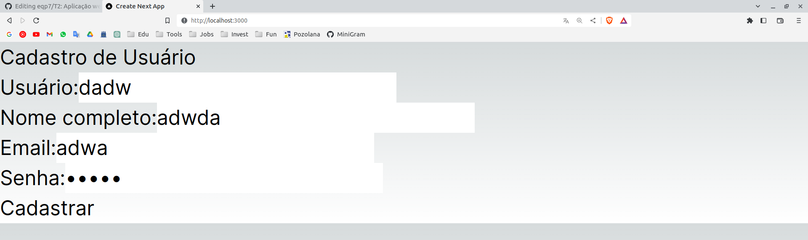

# Tutorial 2 
## Como criar uma aplicação web básica mostrando um formulário html, por exemplo: exibir um formulário de cadastro de usuário (usuario, nome completo, email, senha).

### Passo 1: Configurar o ambiente de desenvolvimento
Certifique-se de ter o Node.js instalado no seu sistema. Você pode verificar a instalação executando node -v no terminal. Se o Node.js não estiver instalado, baixe-o e instale-o a partir do site oficial do Node.js.

```bash
eduardo@eduardo-HP-Pavilion-dv6-Notebook-PC:~/Área de Trabalho/Engenharia de Software II/Tutoriais/T2$
 node -v
```
- Saída esperada:
 
```bash
v20.2.0
```

### Passo 2: Criar um novo projeto Next.js

Abra um terminal e execute o seguinte comando para criar um novo projeto Next.js:

```bash
npx create-next-app nome-do-projeto
```

Isso criará uma nova pasta com o nome fornecido e configurará um projeto Next.js básico.
- Saída esperada:

```bash
✔ Would you like to use TypeScript with this project? … No / Yes
✔ Would you like to use ESLint with this project? … No / Yes
✔ Would you like to use Tailwind CSS with this project? … No / Yes
✔ Would you like to use `src/` directory with this project? … No / Yes
✔ Use App Router (recommended)? … No / Yes
✔ Would you like to customize the default import alias? … No / Yes
Creating a new Next.js app in /home/eduardo/Área de Trabalho/Engenharia de Software II/Tutoriais/T2/form.

Using npm.

Initializing project with template: app-tw 


Installing dependencies:
- react
- react-dom
- next
- typescript
- @types/react
- @types/node
- @types/react-dom
- tailwindcss
- postcss
- autoprefixer
- eslint
- eslint-config-next


added 352 packages, and audited 353 packages in 59s

136 packages are looking for funding
  run `npm fund` for details

found 0 vulnerabilities
Initialized a git repository.

Success! Created form at /home/eduardo/Área de Trabalho/Engenharia de Software II/Tutoriais/T2/form
```

### Passo 3: Navegar para a pasta do projeto
Use o comando cd para navegar até a pasta do projeto que foi criada:

```bash
cd form
```

### Passo 4: Criar um componente de formulário
No diretório do projeto, crie um novo arquivo chamado "CadastroUsuarioForm.js" dentro da pasta "components". Nesse arquivo, adicione o seguinte código:

```javascript
import React from 'react';

const CadastroUsuarioForm = () => {
  return (
    <form>
      <label>
        Usuário:
        <input type="text" name="usuario" />
      </label>
      <br />
      <label>
        Nome completo:
        <input type="text" name="nomeCompleto" />
      </label>
      <br />
      <label>
        Email:
        <input type="email" name="email" />
      </label>
      <br />
      <label>
        Senha:
        <input type="password" name="senha" />
      </label>
      <br />
      <button type="submit">Cadastrar</button>
    </form>
  );
};

export default CadastroUsuarioForm;
```

### Passo 5: Criar uma página para exibir o formulário
No diretório do projeto, abra o arquivo "src/app/page.tsx" e substitua o código existente pelo seguinte:

```javascript
import React from 'react';
import CadastroUsuarioForm from '../../components/CadastroUsuarioForm';

const HomePage = () => {
  return (
    <div>
      <h1>Cadastro de Usuário</h1>
      <CadastroUsuarioForm />
    </div>
  );
};

export default HomePage;
```

### Passo 6: Iniciar o servidor de desenvolvimento
No diretório do projeto, execute o seguinte comando para iniciar o servidor de desenvolvimento:

```bash
npm run dev
```

- Saída esperada:
```bash

> form@0.1.0 dev
> next dev

- ready started server on 0.0.0.0:3000, url: http://localhost:3000
- event compiled client and server successfully in 1225 ms (306 modules)
- wait compiling...
- event compiled client and server successfully in 698 ms (306 modules)
- wait compiling /page (client and server)...
```

### Passo 8: Acessar a aplicação
Abra um navegador da web e acesse http://localhost:3000 para ver a aplicação em execução. Você verá o formulário de cadastro de usuário na página inicial.



A partir daí, você pode estilizar o formulário, adicionar validações e implementar a lógica de envio de dados para um servidor ou banco de dados, conforme necessário.
